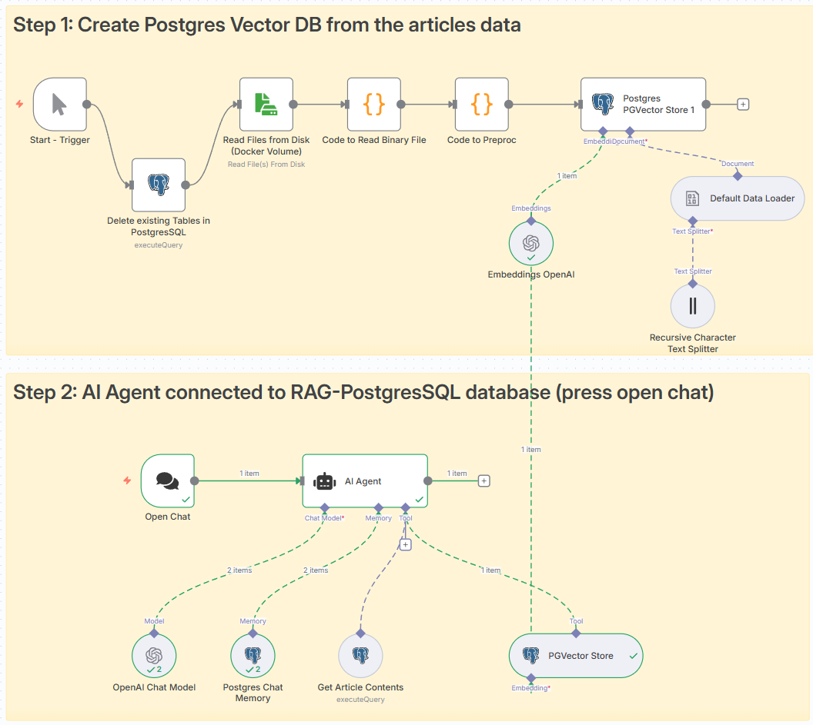

#  AI-powered editorial assistant chatbot that leverages Retrieval-Augmented Generation (RAG) to assist CBC’s editorial teams


[](https://n8n.io/)
[](https://github.com/pgvector/pgvector)
[](#license)

---

## Table of Contents
1. [Overview](#overview)  
2. [Technical Choices](#technical-choices)  
3. [Setup Instructions](#setup-instructions)  
4. [License](#license)


## Overview

<p align="center">
  
</p>


This workflow implements an AI-powered editorial assistant using the n8n agentic framework.  It unifies retrieval, memory, and generation into a single no-code/low-code environment — achieving what’s known as a Retrieval-Augmented Generation (RAG) pipeline. The assistant enables CBC editorial staff to query internal content e.g:  
> “Why was Eastbound Marion Street blocked?”  

and receive fact-based summaries based on the provided articles data. 

**Why n8n?**  
n8n is open-source, modular, and visual, allowing the creation of reproducible AI systems without extensive coding. I think it is such a great framework that even OpenAI decided recently to reproduce it, [See the news](https://parameter.io/openai-agent-builder-zapier-n8n-visual-automation-platform/)


**Bonus Features** 
● Added chat memory as a separate Database table.
● Include a UI with input fields and display responses in a clean format.
● Return citations when applicable article id (metadata id).
● Handles ambiguous queries gracefully (sorry haven't done this yet).

---
##  Technical Choices


The workflow is modular and microservice-inspired, with each step handling a distinct layer of the RAG process.

### 0. Preprocessing
I did a brief data exploration and pre-processing in the `explore_data.ipynb` notebook. I did not focus on getting data correct here, as because of time constraints I decided to focus on AI agent building. Ideally, more time needs to be spend on understanding the data, exploring and pre-processing. 

###  1. Data Ingestion  
**Nodes:**  
`Read Files from Disk → Code to Read Binary File → Code to Preproc`

**Purpose:**  
Loads CBC’s news dataset (e.g., `news-dataset.json_processed.json`) and prepares each article as an individual document with `text` and `metadata` (`content_id`, `body_updated`).

**Why:**  
Each article becomes individually addressable by ID, making citation and retrieval straightforward.


###  2. Vector Storage & Retrieval

**Nodes:**  
`Postgres PGVector Store 1` *(insert)* and `PGVector Store` *(retrieve-as-tool)*

**Purpose:**  
Stores embeddings and metadata in a PostgreSQL database enhanced with pgvector.  
This forms the semantic knowledge base of the assistant.

**Why:**  
- Enables semantic similarity search within SQL.  
- Open-source, scalable, and efficient.  
- Integrated directly into n8n.  
- The `PGVector Store` acts as a retrieval tool, allowing the AI Agent to autonomously query additional context.


###  3. Chat Memory
**Node:**  
`Postgres Chat Memory`

**Purpose:**  
Maintains short-term conversational memory in PostgreSQL.

**Why:**  
Preserves context across turns (e.g., “this article,” “previous topic”) to support agentic memory without external context management.


###  4. Content Access Tools
**Node:**  
`Get Article Contents`

**Purpose:**  
Retrieves full article content by `metadata id`.

**Why:**  
Provides structured access for precise summarization, rewriting, or SEO headline generation. Complements vector search with direct content lookup.


###  5. LLM & Agent Core
**Nodes:**  
Because n8n is modular, there is a variety of models that can be selected, e.g. from Hugging Face and substituted. For the rapid prototyping and because of limited time allocated for this task, I selected OpenAI light, accurate and relatively quick model. The system prompt enforces journalistic tone, factual integrity, and context relevance.

`OpenAI Chat Model (gpt-4o-mini)` + `AI Agent`

**Purpose:**  
- The Chat Model performs reasoning and text generation.  
- The AI Agent orchestrates memory, retrieval, and prompt execution.


---

##  Setup Instructions


### Prerequisites

- [Git](https://github.com/)
- [Docker](https://docs.docker.com/engine/install/)
- [WSL if using Windows](https://learn.microsoft.com/en-us/windows/wsl/install) 

### Step 1. Start the service

Start the docker-compose service by running the command:

```bash
docker-compose up --build
```

### Step 2. Validate the service is running


```bash
docker-compose logs -f
```

The end of the logs should show the following message:

```bash
Editor is now accessible via: https://localhost:5678/
```

### Step 4. Access the service

To get started, open your browser and go to: [https://localhost:5678/](https://localhost:5678/)

Note: For local development, self-signed certificates are used to support OAuth callbacks required by third-party integrations.

To run n8n with Postgres, use:

```bash
docker-compose -f docker-compose.yml -f Postgres/docker-compose.yml up
```

## Step 5. Adminer

Adminer is a database management tool that can be used to manage the databases used by n8n. To access it, open in the browser the URL: [http://localhost:8080/](http://localhost:8080/)

The credentials are pulled directly from the database environment variables. If you are using Postgres, the credentials are:

```bash
System: Postgres
Server: pg-n8n
Username: n8n
Password: password
Database: n8n
```

## Step 6. Docker Volume - 'files' folder
You may need to create a docker volume manually, if not created during "docker-compose" command, in order to be able to access files folder from the n8n. 

Load processed dataset `news-dataset.json_processed.json` into 'files' folder.  

## Step 7. Credentials and Run the workflow
In n8n, configure credentials for:  
   -  OpenAI API Key, PostgreSQL Connection  

Run the workflow and interact via the n8n Chat Trigger UI.


---

##  License
**MIT License © 2025 Aidan (Amanzhol) Kubeyev**